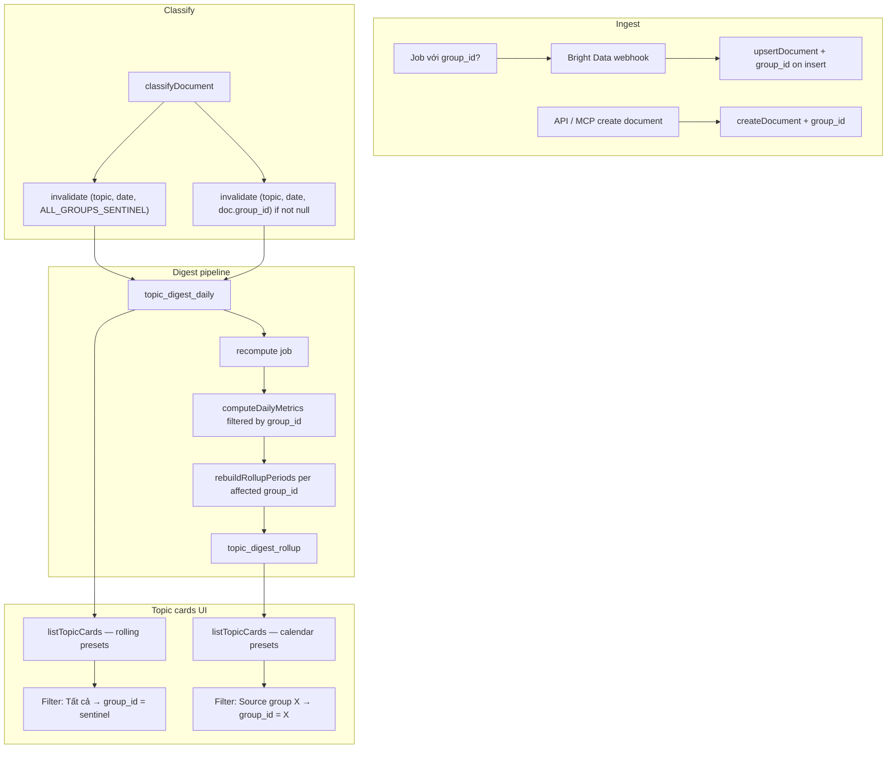

# Document Groups — Implementation Plan

> **Status:** Draft — review before implementation  
> **Scope:** Single phase (schema → ingest → digest → rollup → topic cards UI)  
> **Volume assumption:** ~50 source groups × ~100 topics × multi-year daily history — calendar-period queries must not scan hundreds of daily rows per topic per request.

---

## 1. Mục tiêu

Cho phép filter trending topics theo **source group** (vd. Facebook KOL, Tiktoker), trong khi giữ behavior **“Tất cả”** giống hiện tại (metrics trên mọi documents, không lọc group).

**Use cases:**

- “Last 7 days trending — Facebook KOL” (rolling window → daily grain)
- “This month trending — Facebook KOL” (calendar period → **rollup grain**)
- “Last 7 days trending — Tất cả sources” (như UI hiện tại)
- “This quarter / This year — Source group X” (rollup grain, group-filtered)

---

## 2. Quyết định đã chốt

| # | Quyết định |
|---|------------|
| 1 | **“Tất cả”** = không filter theo group; metrics gồm mọi documents (behavior hiện tại). Dùng **fixed sentinel UUID** trong digest (không dùng `NULL` trong PK). |
| 2 | **Dedup document** không tính `group_id`. Unique key giữ nguyên: `(workspace_id, doc_type, source_key, source_id)`. |
| 3 | **Đổi group trên job** chỉ áp dụng documents **mới** (insert). Upsert/update không ghi đè `group_id` document đã tồn tại. |
| 4 | **API / MCP create document** cho phép chọn group (optional). |
| 5 | **`topic_digest_rollup` cũng partition theo `group_id`** — cùng sentinel pattern như daily. Bắt buộc cho group-filtered calendar periods ở quy mô lớn. |
| 6 | Tên bảng: **`source_groups`** (workspace-scoped). |
| 7 | Migration/backfill: documents & digest hiện có → global sentinel. |
| 8 | Triển khai **một phase** (không tách MVP). |
| 9 | `computeDailyMetrics` filter theo `group_id` khi partition ≠ global. |
| 10 | Cập nhật đồng bộ toàn bộ digest pipeline (invalidate, claim, compute, rollup rebuild, bulk invalidate). |
| 11 | **Hybrid read path:** rolling windows đọc `topic_digest_daily`; calendar presets đọc `topic_digest_rollup`. Sparkline luôn daily (7 ngày). |
| 12 | `trend_rank` trên rollup partition theo **`(workspace_id, group_id)`**, không chỉ workspace. |

---

## 3. Mô hình dữ liệu

### 3.1 Constant

```ts
// lib/source-groups/constants.ts
export const ALL_GROUPS_SENTINEL = "00000000-0000-0000-0000-000000000000";
```

- **Không** là row trong bảng `source_groups`.
- Dùng trong `topic_digest_daily.group_id` và `topic_digest_rollup.group_id` cho partition **global** (all documents).
- UI filter “Tất cả” query partition này.

### 3.2 Bảng `source_groups`

| Column | Type | Notes |
|--------|------|-------|
| `id` | uuid PK | `gen_random_uuid()` |
| `workspace_id` | uuid FK → workspaces | ON DELETE CASCADE |
| `name` | text NOT NULL | Unique per workspace |
| `description` | text | Optional |
| `created_at` | timestamptz | |
| `updated_at` | timestamptz | |

**Indexes:** `UNIQUE (workspace_id, name)`, `(workspace_id)`.

Drizzle export gợi ý: `sourceGroups` / `SourceGroup`.

### 3.3 Cột `group_id` trên `jobs`

| Column | Type | Notes |
|--------|------|-------|
| `group_id` | uuid NULL | FK → `source_groups.id` ON DELETE SET NULL |

- `NULL` = job không gán source group cho documents mới.
- Edit job đổi `group_id` → chỉ documents **insert mới** qua job đó nhận group mới.

### 3.4 Cột `group_id` trên `documents`

| Column | Type | Notes |
|--------|------|-------|
| `group_id` | uuid NULL | FK → `source_groups.id` ON DELETE SET NULL |

- Set lúc **insert** từ job handler hoặc API/MCP.
- `NULL` = document không thuộc source group cụ thể; vẫn được tính trong partition global.
- **Upsert:** nếu document đã tồn tại → **không** update `group_id` (first wins).

**Index:** `(workspace_id, group_id)` — filter/list documents theo group.

### 3.5 `topic_digest_daily` — thêm `group_id`

**PK mới:** `(topic_id, date_key, group_id)`

| `group_id` value | Ý nghĩa metrics |
|------------------|-----------------|
| `ALL_GROUPS_SENTINEL` | Mọi documents (behavior hiện tại) |
| `<source_groups.id>` | Chỉ documents có `documents.group_id = <source_groups.id>` |

**Index mới:** `(group_id, date_key, topic_id)` — rolling-window topic cards + sparkline.

### 3.6 `topic_digest_rollup` — thêm `group_id`

**PK mới:** `(topic_id, period_grain, period_start, group_id)`

| `group_id` value | Ý nghĩa metrics |
|------------------|-----------------|
| `ALL_GROUPS_SENTINEL` | Mọi documents |
| `<source_groups.id>` | Chỉ documents của source group đó |

**Index mới:** `(group_id, period_grain, period_start, trend_score DESC)` — top-N topic cards cho calendar period + group filter.

**Rebuild source:** aggregate từ `topic_digest_daily` **cùng `group_id`**, chỉ rows `is_stale = false`.

**`trend_rank`:** `RANK() OVER (PARTITION BY workspace_id, group_id ORDER BY trend_score DESC)`.

#### Ước lượng storage (planning)

Giả sử workspace có `T` topics, `G` source groups, 4 rollup grains, ~520 week periods trong 10 năm:

```
rows ≈ T × 4 × 520 × (1 + G)
     ≈ T × 2 080 × (1 + G)
```

Với `T=100`, `G=50` → ~10,7M rollup rows/workspace (upper bound lịch sử đầy đủ). Thực tế thấp hơn vì rollup chỉ tạo khi daily partition tồn tại (on-demand). Vẫn cần index `(group_id, period_grain, period_start)` để read path O(topics) không scan daily.

---

## 4. Luồng dữ liệu



---

## 5. Digest — invalidate rules

Khi document được gán / bỏ gán topic (`classifyDocument` và mọi path tương lai gán topic):

1. **Luôn** invalidate `(topicId, dateKey, ALL_GROUPS_SENTINEL)`.
2. **Nếu** `document.group_id IS NOT NULL` → thêm invalidate `(topicId, dateKey, document.group_id)`.

`dateKey` = `date(published_at)` như hiện tại; skip nếu `published_at` null.

Rollup **không có stale flag** — được rebuild đồng bộ sau mỗi batch daily compute (xem §5.4).

### 5.1 `computeDailyMetrics`

```ts
// Pseudocode
if (groupId === ALL_GROUPS_SENTINEL) {
  // COUNT documents joined via document_topics — NO filter on documents.group_id
} else {
  // + AND documents.group_id = groupId
}
```

### 5.2 Pipeline files cần sửa (daily)

| File | Thay đổi |
|------|----------|
| `lib/topic-digests/services/invalidate-topic-digest.ts` | Thêm param `groupId`; upsert PK 3 cột |
| `lib/classification/services/classify-document.ts` | Pass `groupId` từ document; fan-out invalidate (global + group) |
| `lib/topic-digests/utils/compute-daily-metrics.ts` | Filter theo `groupId`; update WHERE PK 3 cột |
| `lib/topic-digests/utils/claim-digest-rows.ts` | Claim/return `(topic_id, date_key, group_id)` |
| `lib/topic-digests/services/recompute-topic-digests.ts` | Pass `groupId`; truyền `(dateKey, groupId)` pairs vào rollup rebuild |
| `lib/topic-digests/services/bulk-drain-topic-digests.ts` | Cùng thay đổi rollup input |
| `lib/topic-digests/utils/reset-stuck-workers.ts` | Không đổi logic (row-level) |
| `lib/topic-digests/services/bulk-invalidate-workspace-digests.ts` | Invalidate **mọi** partition `(topic, date, *)` cho workspace — xem §5.3 |

### 5.3 Bulk taxonomy invalidate

Sau merge/split topics, cần đánh dấu stale **cả** partition global lẫn từng group cho các topics bị ảnh hưởng:

```sql
UPDATE topic_digest_daily tdd
SET is_stale = true, is_bulk_stale = true, ...
FROM topics t
WHERE tdd.topic_id = t.id
  AND t.workspace_id = $workspaceId;
```

(Không filter `group_id` — update all partitions. Rollup rebuild lại sau khi bulk drain recompute daily.)

### 5.4 Rollup rebuild (group-aware)

**Input thay đổi:** từ `dateKeys: string[]` → `affected: Array<{ dateKey, groupId }>` (dedupe trước khi rebuild).

**Algorithm:**

```ts
// 1. Derive unique (grain, periodStart) từ dateKeys (như hiện tại)
// 2. Derive unique groupIds từ affected batch
// 3. For each (grain, periodStart, groupId):
//    INSERT ... SELECT ... FROM topic_digest_daily tdd
//    JOIN dim_dates d ON d.date_key = tdd.date_key
//    WHERE d.<grain_column> = periodStart
//      AND tdd.group_id = groupId          -- NEW: partition match
//      AND tdd.is_stale = false
//    GROUP BY tdd.topic_id
//    ON CONFLICT (topic_id, period_grain, period_start, group_id) DO UPDATE ...
// 4. Re-rank: PARTITION BY (workspace_id, group_id)
```

**Performance notes (large data):**

- Chỉ rebuild `(period, group_id)` có daily thay đổi trong batch — không rebuild toàn bộ workspace mỗi 15 phút.
- Dedupe `(grain, periodStart, groupId)` trong memory trước loop; typical batch 200 rows → ≤200 unique triples, thường ít hơn nhiều.
- Mỗi `rebuildOnePeriod(grain, periodStart, groupId)` scan daily qua `dim_dates` join + `group_id` filter — dùng index `(group_id, date_key, topic_id)`.
- Bulk taxonomy backlog: rollup rebuild chạy sau mỗi bulk-drain batch (50 rows) — chấp nhận drain chậm hơn; không chặn recompute hàng ngày.

| File | Thay đổi |
|------|----------|
| `lib/topic-digests/utils/rebuild-rollup-periods.ts` | Nhận `{ dateKey, groupId }[]`; filter daily by `group_id`; PK/index 4 cột; rank partition by group |
| `lib/topic-digests/types.ts` | Thêm `AffectedDigestPartition` type |

---

## 6. Ingest — jobs & documents

### 6.1 Webhook path

`handleBrightDataJobWebhook` select thêm `jobs.groupId` → truyền vào `upsertDocument`.

### 6.2 `upsertDocument`

Thêm optional `groupId?: string | null` vào params:

| Outcome | `group_id` behavior |
|---------|---------------------|
| **inserted** | Set `groupId` từ job (có thể null) |
| **updated** / **unchanged** | **Không** đổi `group_id` hiện có |

### 6.3 `createDocument` (API / MCP)

- Schema: `groupId: z.string().uuid().optional().nullable()`
- Insert: `group_id: params.groupId ?? null`
- Validate `groupId` thuộc workspace (FK + app check against `source_groups`).

### 6.4 Job create / update

- Schema: `groupId` optional nullable trên create/update job body.
- `createJob` / `updateJob` persist `jobs.group_id`.
- UI: dropdown chọn source group trên job form (`job-menu-form-page.tsx`).

---

## 7. Source groups module (`lib/source-groups/`)

Theo `lib-services` rules:

```
lib/source-groups/
├── constants.ts          # ALL_GROUPS_SENTINEL
├── schema.ts             # Zod: create/update/list
├── types.ts
├── actions.ts            # Server actions (nếu cần UI)
└── services/
    ├── create-source-group.ts
    ├── update-source-group.ts
    ├── delete-source-group.ts
    └── list-source-groups.ts
```

### 7.1 API routes

| Method | Path | Mô tả |
|--------|------|-------|
| GET | `/api/source-groups` | List source groups trong workspace |
| POST | `/api/source-groups` | Tạo source group |
| PATCH | `/api/source-groups/[id]` | Sửa source group |
| DELETE | `/api/source-groups/[id]` | Xóa source group (`ON DELETE SET NULL` trên jobs/documents) |

### 7.2 UI (phase 1)

- **Source groups management page** (hoặc section trong workspace settings): CRUD ~50 groups.
- **Job form:** dropdown source group (optional, “Không chọn group”).
- **Topic list toolbar:** dropdown filter — “Tất cả” | `<source group names>`.
- **Document create form / MCP:** optional source group selector.

---

## 8. Topic cards

### 8.1 API

`GET /api/topics/cards` thêm query param:

```
groupId?: uuid   — omit hoặc ALL_GROUPS_SENTINEL → “Tất cả”
```

Mapping:

| UI | Query |
|----|-------|
| Tất cả | `groupId` absent hoặc `ALL_GROUPS_SENTINEL` |
| Source group X | `groupId=<source_groups.id>` |

### 8.2 Hybrid read strategy (`listTopicCards`)

Tránh SUM daily cho calendar periods dài (vd. `this_month` = 30 rows/topic, `this_year` would be 365).

| Period preset | Data source | Lookup |
|---------------|-------------|--------|
| `last_7_days` | `topic_digest_daily` | SUM `date_key` in range + `group_id` |
| `last_30_days` | `topic_digest_daily` | SUM `date_key` in range + `group_id` |
| `this_week` | `topic_digest_rollup` | `period_grain='week'`, `period_start=<ISO week start>` |
| `last_week` | `topic_digest_rollup` | `period_grain='week'`, `period_start=<prev week start>` |
| `this_month` | `topic_digest_rollup` | `period_grain='month'`, `period_start=<month start>` |
| `last_month` | `topic_digest_rollup` | `period_grain='month'`, `period_start=<prev month start>` |
| `custom` | `topic_digest_daily` | SUM in range + `group_id` (document max-range guidance: ≤90 days) |

**Sparkline:** luôn `topic_digest_daily`, 7 ngày, filter `group_id`.

**Helper mới:** `lib/topics/utils/resolve-topic-card-query-source.ts` — map preset → `{ source: 'daily' \| 'rollup', ... }`.

#### Daily query (rolling / custom)

```sql
AND tdd.group_id = ${resolvedGroupId}::uuid
AND tdd.date_key >= ${startDate}::date
AND tdd.date_key <= ${endDate}::date
-- aggregate: SUM(doc_count), AVG(avg_quality_score), SUM(trend_score)
```

#### Rollup query (calendar)

```sql
JOIN topic_digest_rollup tdr
  ON tdr.topic_id = t.id
 AND tdr.group_id = ${resolvedGroupId}::uuid
 AND tdr.period_grain = ${grain}
 AND tdr.period_start = ${periodStart}::date
-- read: tdr.doc_count, tdr.avg_quality_score, tdr.trend_score directly
```

`is_stale`: daily path dùng `BOOL_OR(tdd.is_stale)`; rollup path rollup không stale — inherit stale từ daily rows trong period nếu cần (optional: subquery check any stale daily in period; phase 1 có thể `isStale=false` cho rollup reads vì rebuild follows daily).

### 8.3 Frontend

- `TopicCardsQueryFilters` + `topic-query-keys.ts`: thêm `groupId?`
- `TopicListToolbar`: dropdown source groups (fetch từ `/api/source-groups`)
- `TopicListPage`: pass filter vào fetch + infinite query key

---

## 9. Migration & backfill

> AI chỉ sửa `db/schema.ts` + `.ai/database-schema.md`. User chạy `npm run db:generate` và `npm run db:migrate`.

### 9.1 Schema migration (Drizzle generate)

1. Tạo bảng `source_groups`.
2. Thêm `jobs.group_id`, `documents.group_id` (nullable FK → `source_groups.id`).
3. Thêm `topic_digest_daily.group_id NOT NULL DEFAULT ALL_GROUPS_SENTINEL`.
4. Drop PK cũ `(topic_id, date_key)` → PK mới `(topic_id, date_key, group_id)`.
5. Thêm index `(group_id, date_key, topic_id)` trên daily.
6. Thêm `topic_digest_rollup.group_id NOT NULL DEFAULT ALL_GROUPS_SENTINEL`.
7. Drop PK cũ `(topic_id, period_grain, period_start)` → PK mới `(topic_id, period_grain, period_start, group_id)`.
8. Thêm index `(group_id, period_grain, period_start, trend_score DESC)` trên rollup.
9. Drop/replace index cũ `idx_topic_digest_rollup_grain_period` (thiếu `group_id`).

### 9.2 Data backfill (SQL thủ công hoặc script sau migrate)

```sql
-- Documents hiện có: giữ group_id NULL (ungrouped)
-- Digest daily hiện có: gán ALL_GROUPS_SENTINEL (default nếu column added with default)
UPDATE topic_digest_daily SET group_id = '00000000-0000-0000-0000-000000000000'
WHERE group_id IS NULL;

-- Rollup hiện có: gán ALL_GROUPS_SENTINEL
UPDATE topic_digest_rollup SET group_id = '00000000-0000-0000-0000-000000000000'
WHERE group_id IS NULL;
```

Không recompute ngay — metrics global vẫn đúng vì partition sentinel = toàn bộ documents như trước.

Documents mới có `group_id` → partition group sẽ được populate dần qua invalidate + recompute + rollup rebuild.

### 9.3 Optional: backfill group partitions

Nếu muốn metrics lịch sử cho từng group ngay sau deploy:

1. Script bulk invalidate `(topic_id, date_key, group_id)` cho mọi `(topic, date)` × mỗi `source_groups.id` có documents.
2. Chạy bulk drain job cho daily.
3. Script rollup backfill: `rebuildRollupPeriods` cho mọi `(grain, period_start, group_id)` có daily rows — chạy off-peak, batch theo workspace.

**Không bắt buộc** cho go-live; calendar group filter sẽ populate dần.

---

## 10. Edge cases

| Case | Hành vi |
|------|---------|
| Cùng post, 2 job khác group | Dedup → document giữ `group_id` lần insert đầu |
| Document `group_id = NULL` | Tính trong global partition; **không** có row digest riêng cho “null group” |
| Xóa source group | FK `SET NULL` trên jobs/documents; digest/rollup rows group cũ orphaned — giữ rows, idle |
| Job `group_id = NULL` | Documents insert với `group_id = NULL` |
| Classify document không có `published_at` | Skip invalidate (như hiện tại) |
| Empty source group | Query trả topics với metrics 0 / null |
| Calendar preset, group chưa có rollup row | LEFT JOIN → metrics 0; populate sau recompute |
| Custom range >90 days | Vẫn daily SUM (chậm hơn); cân nhắc thêm quarter/year presets dùng rollup sau |

---

## 11. Testing checklist

### Unit / integration

- [ ] `computeDailyMetrics` — global vs specific group counts đúng
- [ ] `invalidateTopicDigest` — tạo row đúng PK 3 cột; debounce GREATEST vẫn hoạt động
- [ ] `rebuildRollupPeriods` — rebuild đúng partition `group_id`; không cross-contaminate global vs group
- [ ] `rebuildRollupPeriods` — `trend_rank` độc lập per `(workspace, group_id)`
- [ ] `upsertDocument` — insert set group; update không đổi group
- [ ] `createDocument` — validate group thuộc workspace (`source_groups`)
- [ ] `listTopicCards` — rolling preset → daily; calendar preset → rollup
- [ ] `listTopicCards` — filter global vs group trên cả daily và rollup paths

### Manual QA

- [ ] Tạo 2 source groups, 2 jobs (mỗi job 1 group), scrape → documents có đúng `group_id`
- [ ] Classify → global + group digest stale → recompute → rollup rebuilt → topic cards đúng
- [ ] Filter “Tất cả” khớp metrics trước khi deploy (so sánh sample)
- [ ] Filter từng source group chỉ reflect documents của group đó
- [ ] `this_month` + group filter đọc rollup (verify EXPLAIN / row count vs daily SUM)
- [ ] Edit job đổi group → documents cũ giữ group cũ
- [ ] Dedup: scrape cùng post từ job khác group → `group_id` không đổi

---

## 12. Implementation order

| Step | Task |
|------|------|
| 1 | `lib/source-groups/` — constants, schema, types, CRUD services, API routes |
| 2 | `db/schema.ts` — `source_groups`, `jobs.group_id`, `documents.group_id`, `topic_digest_daily.group_id`, `topic_digest_rollup.group_id` + indexes |
| 3 | Update `.ai/database-schema.md` → user runs `db:generate` + `db:migrate` |
| 4 | Digest daily pipeline — invalidate, claim, compute, bulk invalidate |
| 5 | Rollup pipeline — `rebuild-rollup-periods.ts` group-aware; wire recompute + bulk-drain |
| 6 | Ingest — `upsertDocument`, webhook, `createDocument`, MCP schema |
| 7 | Jobs — schema/types/services/UI source group selector |
| 8 | Topics — hybrid `listTopicCards`, query source resolver, API query schema, types |
| 9 | UI — source groups management, topic toolbar filter, document form group field |
| 10 | Manual QA theo checklist §11 |

---

## 13. Files dự kiến thay đổi (reference)

### New

- `lib/source-groups/**`
- `lib/topics/utils/resolve-topic-card-query-source.ts`
- `app/api/source-groups/route.ts`
- `app/api/source-groups/[id]/route.ts`
- `components/source-groups/**` (hoặc workspace settings subsection)
- `docs/dev/document-groups-plan.md` (this file)

### Modified

- `db/schema.ts`
- `.ai/database-schema.md`
- `lib/topic-digests/**` (invalidate, claim, compute, recompute, bulk drain, rebuild rollup, types)
- `lib/classification/services/classify-document.ts`
- `lib/documents/**` (schema, types, upsert, create)
- `lib/jobs/**` (schema, types, create, update, get)
- `lib/jobs/services/handle-bright-data-webhook.ts`
- `lib/topics/services/list-topic-cards.ts`
- `lib/topics/types.ts`
- `app/api/topics/cards/route.ts`
- `app/api/documents/route.ts`
- `lib/mcp/build-mcp-server.ts`
- `components/jobs/job-menu-form-page.tsx`
- `components/topics/topic-list-toolbar.tsx`
- `components/topics/topic-list-page.tsx`
- `components/topics/topic-query-keys.ts`
- `docs/ops/topic-digests.md`

---

## 14. Rủi ro & mitigations

| Rủi ro | Mitigation |
|--------|------------|
| Invalidate fan-out 2× mỗi classify (global + group) | Chấp nhận được; queue 200/15min đủ cho volume hiện tại |
| Rollup rebuild fan-out per batch | Dedupe `(grain, period, group_id)`; chỉ rebuild partitions affected |
| Rollup storage × (1 + G groups) | On-demand rows; monitor table size; archive orphaned group partitions tuỳ chọn |
| Group partition chưa backfill → filter group trống lúc đầu | Docs mới + classify populate dần; optional backfill script §9.3 |
| Orphan digest/rollup rows sau xóa source group | Low priority cleanup; không ảnh hưởng global |
| PK migration trên bảng digest đang có data | Test migrate trên staging; default sentinel gán cho rows cũ |
| Bulk taxonomy + group rollup rebuild chậm | Bulk drain batch nhỏ (50); rollup rebuild per batch; chấp nhận multi-hour drain |
| Calendar query without rollup row | LEFT JOIN + COALESCE 0; rollup builds on next daily recompute for that period |

---

## 15. Open items (none blocking)

Không còn câu hỏi blocking. Có thể bắt đầu implement theo §12 sau khi review plan này.

**Future (không blocking phase 1):**

- Thêm presets `this_quarter`, `this_year` (rollup grains đã sẵn).
- Custom range >90 days: decompose thành rollup sub-periods + daily edges.
- Periodic job prune orphaned rollup rows cho deleted source groups.
