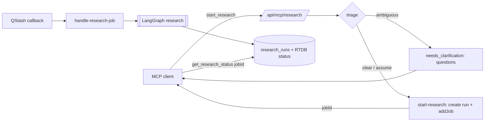
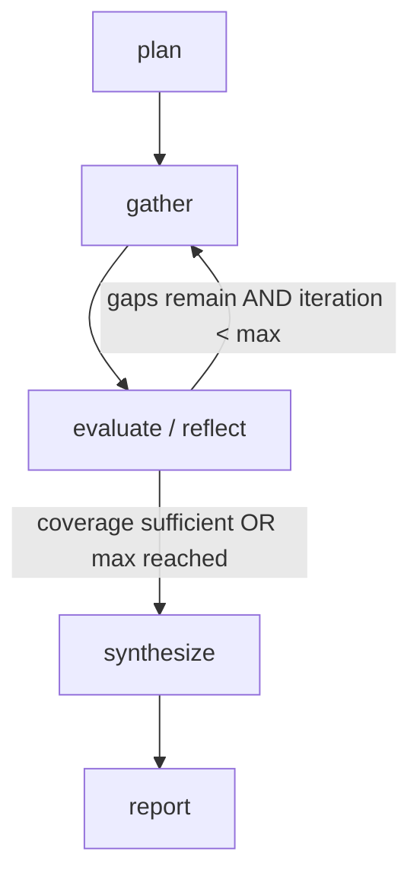

# Research (MCP Deep-Research Endpoint) — Implementation Plan

> Status: **DRAFT — for review before implementation.**
> This document is a plan, not shipped behaviour. Sections marked **OPEN** need a decision.

An MCP endpoint that runs a full research loop over the workspace knowledge base:
understand the request → plan → search → evaluate → search more → synthesize a cited report.

## Goals

- One MCP capability that performs multi-step (agentic) research, not a single retrieval call.
- Reuse existing retrieval: `lib/retrieval/services/search-chunks.ts`, `get-document-comments`, term analytics, and Exa web research (`exaAnswerTool`).
- Return a synthesized, cited report — with the option to ask the user clarifying questions when the request is ambiguous.

## Decisions (locked)

| Topic | Decision |
| --- | --- |
| Exposure | New MCP server + route `/api/mcp/research` (separate from `/api/mcp/search`) |
| Runtime | Async via QStash job; tool returns a `jobId`, client polls for status/report |
| Status tracking | Firebase RTDB `jobs/{jobKey}` (realtime) + durable `research_runs` DB row |
| Engine | LangGraph `StateGraph` (explicit phases), reusing existing tools/services |
| Web research | Exa **search** as primary primitive (`lib/exa/services/exa-search.ts`), gated by `isExaConfigured()` |
| Clarification | Approach **A** — clarify at triage, *before* enqueue (stateless, no graph checkpointer) |
| Clarify round-trip | **Stateless** — client re-sends `query` + `context` + `clarifications` |
| `clarificationMode` | **Kept** as an input knob; default `ask` |
| Report format | **Free-form markdown** (no structured report schema) |
| `research_runs` table | **Approved** — durable canonical run + report |
| `depth` knob | **Added** — `quick \| standard \| deep`, default `standard` (maps to iterations/subqueries/model) |

## Auth & tenancy

- Route auth reuses `verifyWorkspaceKey` (Unkey), same as `/api/mcp/search`.
- `workspaceId` is **always** taken from the verified key — never from tool input — to prevent cross-tenant access.

## High-level flow



## LangGraph research graph



Nodes:

- **plan** — LLM (fast model) turns `query + context` into sub-questions + an initial list of **typed tasks** (`researchTaskSchema`). It *derives scope internally* (which task kinds, time window for analytics, whether to use web) — scope is not a user parameter.
- **gather** — dispatches every pending task to its source runner (`lib/research/sources/run-research-task.ts`) in parallel. All runners return `Finding[]`, which land in the unified `findings` list. Merge + dedupe by `ref`: `doc:{documentId}` for internal chunks, the URL for web results, `analytics:…` for analytics snapshots. Tasks are deduped across iterations by `buildTaskKey` (`completedTaskKeys` in state).

  **Task kinds / sources**

  | task kind | runner | what it does | finding kind |
  | --- | --- | --- | --- |
  | `search { query }` | `sources/search-source.ts` | `searchChunks` (workspace-scoped, enriched) + `exaSearch` when `isExaConfigured()`, in parallel | `internal`, `web` |
  | `term_analytics { query, period }` | `sources/term-analytics-source.ts` | `findTopTerms` (keyword or term-group resolution) → `getTermAnalytics` for the top `RESEARCH_ANALYTICS_MAX_TERMS` → **one** table-style finding (docs, trend, quality, docs over time in ≤ `RESEARCH_ANALYTICS_MAX_BUCKETS` buckets, peak day). Best-effort: failures log and return `[]`. `period` is one of `RESEARCH_TERM_PERIODS` (relative presets only). | `analytics` |

  The plan/evaluate prompts share `buildTaskGuidance()` which tells the LLM when each kind is appropriate (analytics only for volume/trend/ranking questions). Adding a new data source = add a member to `researchTaskSchema`, a runner in `sources/`, a case in `runResearchTask` (exhaustive switch — compile error if missed), and a line in `buildTaskGuidance()`. Graph, evaluate, and synthesize do not change.

  > **Why Exa search, not Exa answer:** the graph owns planning/evaluation/synthesis. `/answer` is a black-box mini-RAG (Exa runs its own LLM), which duplicates our loop and returns pre-digested prose that's hard to evaluate/dedupe. `/search` returns raw sources our nodes control uniformly with internal chunks. (`exaAnswer` remains available for quick entity disambiguation but is not the evidence primitive.)

  **Internal finding enrichment** (`enrichInternalFindings`): retrieved chunks are enriched before becoming findings. `searchChunks` is extended (hybrid scope) with cheap columns already available on the joined rows — `viewCount`, `likeCount`, `shareCount`, chunk `contentType`, `mediaUrl`, and `parentDocumentId`. Two batched, id-keyed queries add the heavier data without touching the retrieval hot path:

  | doc type / chunk | enrichment |
  | --- | --- |
  | `post` (any chunk) | append engagement line (views/likes/comments/shares) |
  | `post` + `image` chunk | embed the archived image as Markdown `` |
  | `post` + `text` chunk | `attachments`: eligible image/video parts `{ type, summary, url }` |
  | `discussion` (any chunk) | `docContext`: parent post text (joined text parts) as the discussion topic |

  Image/video chunks get no extra summary — their content already *is* the media's LLM summary. Enrichments are folded into the finding content so they read uniformly with web findings in the prompts.
- **evaluate / reflect** — LLM (`withStructuredOutput`) scores coverage vs. plan, lists gaps → new typed tasks (filtered against `completedTaskKeys`). Conditional edge loops back to **gather** while gaps remain and `iteration < MAX_ITERATIONS`.
- **synthesize** — LLM (strong model) writes the report with citations, using `formatFindings` for numbered `[n]` references. Internal evidence is the primary authority for qualitative claims; analytics evidence is the authority for quantitative claims (volumes, trends, rankings); web only supplements.

**State**: `query`, `background`, `plan`, `tasks` (pending, replaced each iteration), `completedTaskKeys`, `findings` (deduped by `ref`), `iteration`, `sufficient`, `gaps`, `report`.
**Context** (`ResearchGraphContext`): `workspaceContext` (synthetic `WorkspaceContext` with `userId = RESEARCH_SYSTEM_USER_ID`, used by every workspace-scoped service), `webEnabled`, `maxIterations`, `maxSubQueries` (max tasks of any kind per iteration), `synthesizeModel`.
Guards: `MAX_ITERATIONS` (2–3), `MAX_SUBQUERIES`, graph `recursionLimit`, dedupe by `ref`, token budget. Fast model for plan/evaluate, strong model for synthesize (via `parseChatModel` + defaults in `config.ts`).

## Tool input (context-centric)

Research input is mostly natural language — **the goal plus its background** — with almost no tuning parameters. Scope (terms, period, web usage, depth) is inferred by the graph.

```ts
inputSchema: {
  query: z
    .string()
    .min(1)
    .describe(
      "Core research goal/question in natural language. State what you want to learn and (if any) the end purpose.",
    ),

  context: z
    .string()
    .nullable()
    .describe(
      "Background that shapes the research: what you already know, the purpose, scope of interest, " +
        "constraints, target audience, desired report format/depth, or prior findings. null if none.",
    ),

  // Clarification answers ARE additional context, gathered via approach A.
  clarifications: z
    .array(z.object({ question: z.string(), answer: z.string() }))
    .nullable()
    .describe(
      "Answers to the clarifying questions from a previous call — treated as extra background. " +
        "null on the first call.",
    ),

  clarificationMode: z
    .enum(["ask", "assume", "off"])
    .nullable()
    .describe(
      "ask = ask when ambiguous; assume = proceed with stated assumptions; off = never ask. null = default (ask).",
    ),

  depth: z
    .enum(["quick", "standard", "deep"])
    .nullable()
    .describe(
      "Research effort/latency trade-off. quick = fast single pass; standard = balanced; " +
        "deep = more iterations and broader coverage. null = default (standard).",
    ),
}
```

`depth` is a **semantic effort knob** (user intent about cost/latency), not a content-scope
parameter — it cannot be inferred from the question. It maps to internal config; raw numbers
are never exposed:

| `depth` | maxIterations | maxSubQueries | synthesize model |
| --- | --- | --- | --- |
| `quick` | 1 | ~3 | fast |
| `standard` | 2 | ~5 | strong |
| `deep` | 3–4 | ~8 | strong |

`context` and `clarifications` are merged into a single **background** block that the plan node reads:

```
[user context]
+ [each Q → A pair from clarifications]
= full background for planning
```

## Tools & outputs

Two MCP tools on the research server:

### `start_research`

Runs triage synchronously, then either asks for clarification or enqueues the job. After enqueueing it **waits inline up to ~30s** (polling the DB every ~2.5s) for the worker to finish: if the run succeeds within the window it returns the report immediately (`completed`); otherwise it hands back the `jobId` (`started`) and the QStash worker keeps running. The QStash job is always the sole executor — the inline wait only observes, so there is no double execution.

```ts
type StartResearchResult =
  | { status: "needs_clarification"; questions: string[] }
  | { status: "started"; jobId: string }
  | { status: "completed"; jobId: string; report: string; sources: ResearchSource[] };
```

Config: `RESEARCH_INLINE_WAIT_MS` (30s), `RESEARCH_POLL_INTERVAL_MS` (2.5s). The route sets `export const maxDuration = 60` so the inline wait fits within platform time limits. On failure within the window, the tool returns `started` and the error surfaces via `get_research_status`.

Clarify round-trip (approach A, stateless before enqueue):

1. Client calls `start_research({ query, context })`.
2. If triage finds it ambiguous and `clarificationMode !== "off"` → `{ status: "needs_clarification", questions }`.
3. User answers → client calls `start_research({ query, context, clarifications: [...] })`.
4. Clear (or `mode = "assume"`) → create `research_runs` row + `addJob` → `{ status: "started", jobId }`.

### `get_research_status`

Reads the durable run; returns `status` and, when `succeeded`, the **free-form markdown** report + sources + usage.

```ts
type ResearchStatus =
  | { status: "pending" | "running"; progress?: { iteration: number; found: number } }
  | { status: "succeeded"; report: string /* markdown */; sources: SourceItem[]; usage: {...} }
  | { status: "failed"; error: string };
```

The `synthesize` node produces free-form markdown (summary + narrative + inline `[n]` citations); there is no structured report schema. `sources` come from `formatSources`.

## Persistence

- **`research_runs` table (canonical)** — `id`, `workspaceId`, `status` (`pending|running|succeeded|failed`), `query`, `background`, `depth`, `result` (jsonb: `{ report, sources, iterations, findingCount }`), `error`, timestamps. `get_research_status` reads this table (server-side polling), so the DB is the source of truth.
- **Firebase RTDB `jobs/{runId}` (realtime mirror, best-effort)** — lightweight status written via `getAdminDatabase()`; no-op when Firebase admin isn't configured. The dedicated `job-status-tracking` services from the skill do **not** exist in this repo yet, so we write RTDB directly. `runId` is a uuid (unguessable), used as the RTDB key. This mirror is only for a future live UI; the MCP flow does not depend on it.

> Adding `research_runs` is a schema change: edit `db/schema.ts` + `.ai/database-schema.md` only; migrations are generated by the user (`npm run db:generate` / `npm run db:migrate`).

## File structure (lib-services conventions)

```
lib/research/
├── config.ts                    # MAX_ITERATIONS, MAX_SUBQUERIES, plan/eval/synth models, token budget, RESEARCH_QSTASH_JOB_NAME
├── schema.ts                    # startResearchRequestSchema, researchJobPayloadSchema
├── types.ts                     # ResearchState, ResearchParams, ResearchRun, ResearchReport
├── graph/
│   ├── build-research-graph.ts  # StateGraph + edges + recursionLimit
│   ├── state.ts                 # ResearchStateAnnotation + ResearchGraphContext
│   └── nodes/{plan,gather,evaluate,synthesize}.ts
├── sources/                     # one runner per task kind + dispatcher
│   ├── types.ts                 # ResearchSourceRunner<K> contract
│   ├── search-source.ts         # internal searchChunks + Exa web
│   ├── term-analytics-source.ts # findTopTerms → getTermAnalytics → table finding
│   └── run-research-task.ts     # exhaustive switch: task.kind → runner
├── services/
│   ├── triage-research.ts       # synchronous clarify decision (used by start_research)
│   ├── start-research.ts        # create run + RTDB job + addJob → { jobId }
│   ├── run-research.ts          # pure: run graph for one run, write progress, return report
│   ├── handle-research-job.ts   # QStash handler: running → run-research → succeeded/failed
│   └── get-research-run.ts      # read run for get_research_status
└── utils/
    ├── build-background.ts       # merge context + clarifications into one background block
    ├── build-task-guidance.ts    # prompt fragment: task kinds + when to use each (plan/evaluate)
    ├── build-task-key.ts         # dedupe key for tasks across iterations
    ├── merge-findings.ts         # dedupe findings across iterations by ref
    ├── format-findings.ts        # build synthesis context + numbered sources (all kinds)
    ├── format-finding-kind-label.ts        # citation label per finding kind
    ├── format-term-analytics-finding.ts    # render analytics snapshot as Markdown table
    └── mirror-research-status.ts # best-effort RTDB status write via getAdminDatabase()

lib/exa/
└── services/exa-search.ts        # NEW: /search + contents, mirrors exa-answer.ts (ported from boxx-blog)

lib/mcp/research/
├── build-research-mcp-server.ts
└── tools/{start-research,get-research-status}.ts

app/api/mcp/research/route.ts    # verifyWorkspaceKey → buildResearchMcpServer({ workspaceId })
```

## QStash wiring

- Job name constant `RESEARCH_QSTASH_JOB_NAME` in `lib/research/config.ts`.
- `handle-research-job` parses `{ runId }` with zod, no-ops on terminal status (same pattern as `processTermBackfillBatch`).
- Register `RESEARCH_QSTASH_JOB_NAME → handleResearchJob` in `lib/qstash/job-config.ts` (`qstashJobHandlers`).
- Enqueue with `addJob({ jobName, payload: { runId }, userId })`.

## Dependencies

- Add `@langchain/langgraph` as a **direct** dependency (currently transitive via `langchain` 1.5).
- Already present: `@modelcontextprotocol/sdk`, `langchain` + `@langchain/*`, Exa (`exaAnswerTool`).

## Guardrails

- `MAX_ITERATIONS` 2–3, `MAX_SUBQUERIES`, graph `recursionLimit`, `toolCallLimitMiddleware` if an agent is used inside a node.
- Dedupe findings by `documentId`; enforce token budget.
- Exa gated by `isExaConfigured()`; graph runs internal-only when web research is unavailable.
- MCP tools stay fast (enqueue/read only); long work lives in the QStash worker, avoiding route timeouts.

## Resolved decisions (from review)

1. **`research_runs` table** — ✅ add it as the durable canonical store for run + report.
2. **Clarify round-trip** — ✅ stateless; client re-sends `query` + `context` + `clarifications` on the follow-up call.
3. **`clarificationMode`** — ✅ kept as an input knob, default `ask`.
4. **Report format** — ✅ free-form markdown; no structured report schema.

## Implementation phases (after approval)

1. `lib/research` skeleton: `config.ts`, `schema.ts`, `types.ts`.
2. LangGraph graph + nodes (`plan`, `search`, `evaluate`, `synthesize`) + `run-research`.
3. `research_runs` schema (`db/schema.ts` + `.ai/database-schema.md`) + `triage-research`, `start-research`, `handle-research-job`, `get-research-run`; register QStash handler.
4. MCP server/route: `build-research-mcp-server` + `start_research` / `get_research_status` tools + `app/api/mcp/research/route.ts`.
5. Add `@langchain/langgraph` dep; wire RTDB job mirroring; final docs update.
